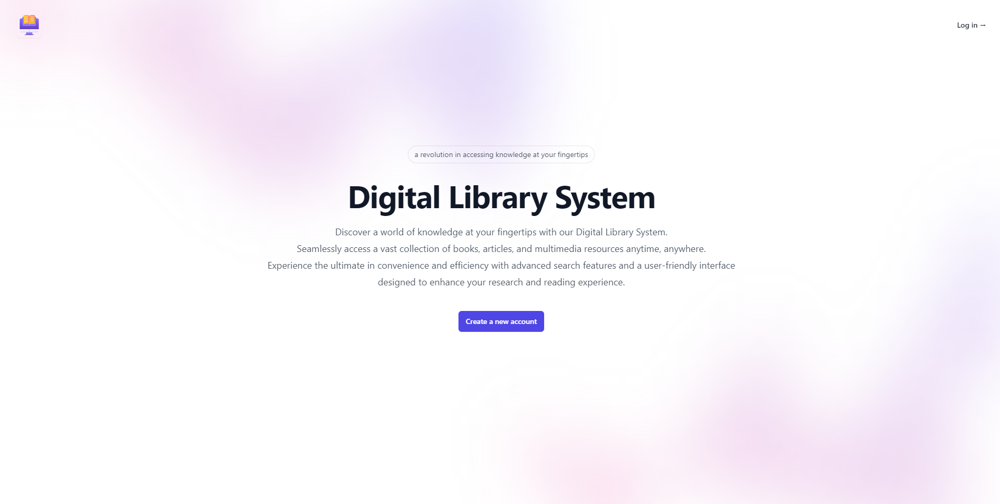

# Digital Library System

The **Digital Library System** is a J2EE-based project designed for managing and accessing digital library resources. This system allows users to search, view, and manage a digital collection of books and other resources.

## Table of Contents

1. [Project Overview](#project-overview)
2. [Features](#features)
3. [Folder Structure](#folder-structure)
4. [Setup Instructions](#setup-instructions)
5. [Technologies Used](#technologies-used)
6. [Database Schema](#database-schema)
7. [Screenshots](#screenshots)

## Project Overview

This project provides a web-based interface to access a digital library's resources, with features like resource search, categorization, and user management.

## Features

- **Search Functionality**: Search for books and other resources by title, author, or category.
- **User Authentication**: Secure login and access control for users.
- **Resource Management**: Add, edit, delete, and manage digital resources.
- **Responsive Design**: The frontend is designed to be responsive, suitable for different screen sizes.

## Folder Structure

- **Frontend**: Contains the website template and design files.
- **digital-library-system**: The entire J2EE project, which includes all the backend logic and services.
- **db_lbms.sql**: The SQL file that defines the database schema for the system.

## Setup Instructions

### Prerequisites

- Java Development Kit (JDK)
- Apache Tomcat (or any servlet container)
- MySQL Database (or any relational database system)
- A modern web browser

### Step-by-Step Setup

1. Clone the repository:

   ```bash
   git clone https://github.com/aung-khantkyaw/Digital-Library-System.git
   ```

2. Import the J2EE project in your favorite IDE (e.g., Eclipse or IntelliJ).

3. Deploy the project to your local Tomcat server. (I use Tomcat server 10.1 version.)

4. Create the database and import the schema:

   ```sql
   CREATE DATABASE digital_library_system;
   USE digital_library_system;
   SOURCE digital_library_system.sql;
   ```

5. Configure your database connection details in the project’s `DatabaseConnection.java`.

6. Start the server and access the application in the browser:
   ```
   http://localhost:8080/digital-library-system
   ```

## Technologies Used

- **Frontend**: HTML, CSS, JavaScrip
- **Backend**: Java, JSP, Servlets, J2EE
- **Database**: MySQL
- **Server**: Apache Tomcat

## Database Schema

The `digital_library_system.sql` file provides the database schema, which includes the following tables and triggers:

### **Tables**

- **Users**: Storing user information and roles.
  - Columns: `user_id`, `username`, `password`, `password_key`, `email`, `phone_number`, `profile`, `address`, `role`, `status`, `registration_date`.

- **Authors**: Storing information about the authors of books.
  - Columns: `author_id`, `author_name`, `author_profile`, `author_biography`.

- **Genres**: Storing information about different genres of books.
  - Columns: `genre_id`, `genre_name`.

- **Publishers**: Storing publisher information.
  - Columns: `publisher_id`, `publisher_name`, `publisher_profile`, `publisher_address`, `publisher_email`, `publisher_phone_number`.

- **Shelf Locations**: Storing information about the physical location of books in the library.
  - Columns: `shelf_id`, `shelf_location`.

- **Physical Books**: Storing details about physical books in the library.
  - Columns: `book_id`, `ISBN`, `title`, `cover`, `genre_id`, `author_id`, `publisher_id`, `publish_date`, `shelf_id`, `quantity`, `status`, `registration_date`.

- **Ebooks**: Storing details about ebooks in the library.
  - Columns: `book_id`, `ISBN`, `title`, `cover`, `genre_id`, `author_id`, `publisher_id`, `publish_date`, `url`, `registration_date`.

- **Physical Borrowing Transactions**: Tracking the borrowing and returning of physical books by users.
  - Columns: `borrow_id`, `user_id`, `book_id`, `borrow_date`, `due_date`, `return_date`, `status`, `pay_amount`, `fine`.

- **Ebook Borrowing Transactions**: Tracking the borrowing and returning of ebooks by users.
  - Columns: `borrow_id`, `user_id`, `book_id`, `borrow_date`, `due_date`, `status`.

### **Triggers**

- **`physical_borrow_trigger`**: Trigger that fires before a physical book borrowing occurs. It checks if the book is available and updates the book quantity and status accordingly.
  - If the quantity is `0`, the trigger will prevent the transaction and raise an error.
  - If the book is successfully borrowed, the quantity is decreased by 1 and, if necessary, the book status is updated to "Unavailable".

- **`physical_return_trigger`**: Trigger that fires before updating a physical borrowing transaction when a book is returned. It increases the book quantity by 1 and updates the book's status to "Available" if needed.

- **`fine_trigger`**: Trigger that fires before updating a physical borrowing transaction to calculate a fine if the book is returned late. The fine is calculated as `0.5` times the daily rate per day overdue.

- **`ebook_return_trigger`**: Trigger that automatically sets the status of an ebook borrowing transaction to "Returned" if the due date has passed.

### **Events**
- **`ebook_return_event`**: CREATE DEFINER=`root`@`localhost` EVENT `update_overdue_books` ON SCHEDULE EVERY 1 DAY STARTS '2024-08-24 00:09:12' ON COMPLETION NOT PRESERVE ENABLE DO BEGIN UPDATE ebook_borrow SET status = 'Returned' WHERE due_date < CURDATE(); END
---

This schema ensures the proper functioning of the digital library system by managing user roles, books, authors, publishers, genres, shelf locations, and borrowing transactions. The triggers enforce business logic such as availability checks, status updates, and fine calculations.


## Screenshots


